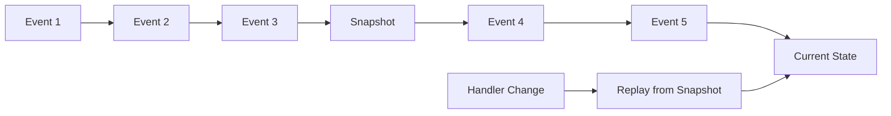

# Event Sourcing with StreamDingo

Event sourcing is a powerful architectural pattern that stores data as a sequence of events rather than the current state. StreamDingo makes event sourcing accessible and efficient in .NET applications.

## Core Principles

### Immutable Event Log
Instead of updating records in place, event sourcing appends new events to an immutable log:

```csharp
// Traditional approach (mutating state)
user.Email = "newemail@example.com";
user.UpdatedAt = DateTime.UtcNow;
database.Update(user);

// Event sourcing approach (append events)
var @event = new UserEmailChanged(user.Id, "newemail@example.com", DateTime.UtcNow);
await eventStore.AppendEventAsync(user.Id, @event);
```

### State Reconstruction
Current state is reconstructed by replaying events from the beginning:

```csharp
var events = await eventStore.GetEventsAsync(userId);
var currentUser = events.Aggregate((UserAggregate?)null, (state, @event) =>
    @event switch
    {
        UserRegistered e => UserEventHandlers.Handle(state, e),
        UserEmailChanged e => UserEventHandlers.Handle(state, e),
        UserDeactivated e => UserEventHandlers.Handle(state, e),
        _ => state
    });
```

## Benefits of Event Sourcing

### Complete Audit Trail
Every change is preserved with full context:

```csharp
public record UserEmailChanged(
    string UserId, 
    string NewEmail, 
    string PreviousEmail, 
    DateTime ChangedAt, 
    string ChangedBy,
    string Reason
);
```

### Time Travel
Query your system's state at any point in time:

```csharp
// Get user state as of a specific date
var userStateAt = await streamManager.ReplayEventsAsync<UserAggregate>(
    userId, 
    upToTimestamp: DateTime.Parse("2024-01-15"));
```

### Event-Driven Integration
Events can trigger downstream processes:

```csharp
public class UserEmailChangedHandler : IEventHandler<UserEmailChanged>
{
    public async Task HandleAsync(UserEmailChanged @event)
    {
        // Update search index
        await searchService.UpdateUserEmailAsync(@event.UserId, @event.NewEmail);
        
        // Send notification
        await emailService.SendEmailChangeConfirmationAsync(@event.NewEmail);
        
        // Update analytics
        await analyticsService.TrackUserEmailChangeAsync(@event.UserId);
    }
}
```

## StreamDingo's Approach

### Handler-Based Architecture
StreamDingo uses pure functions to handle events:

```csharp
public class UserEventHandlers
{
    public static UserAggregate Handle(UserAggregate? state, UserRegistered @event)
        => new UserAggregate(
            Id: @event.UserId,
            Email: @event.Email,
            Name: @event.Name,
            Status: UserStatus.Active,
            Version: (state?.Version ?? 0) + 1
        );
    
    public static UserAggregate Handle(UserAggregate state, UserEmailChanged @event)
        => state with { 
            Email = @event.NewEmail, 
            Version = state.Version + 1 
        };
}
```

### Intelligent Replay
StreamDingo optimizes replay using snapshots and hash-based change detection:



## Implementation Patterns

### Basic Event Store Setup

```csharp
// Configure event store
services.AddSingleton<IEventStore, InMemoryEventStore>();
services.AddSingleton<ISnapshotStore, InMemorySnapshotStore>();
services.AddSingleton<IHashProvider, HashStampProvider>();
services.AddSingleton<IEventStreamManager, EventStreamManager>();

// Register event handlers
services.AddEventHandler<UserAggregate, UserRegistered>(UserEventHandlers.Handle);
services.AddEventHandler<UserAggregate, UserEmailChanged>(UserEventHandlers.Handle);
```

### Command Handler Pattern

```csharp
public class UserCommandHandler
{
    private readonly IEventStreamManager _streamManager;
    
    public UserCommandHandler(IEventStreamManager streamManager)
    {
        _streamManager = streamManager;
    }
    
    public async Task<UserAggregate> RegisterUserAsync(RegisterUserCommand command)
    {
        var @event = new UserRegistered(
            UserId: Guid.NewGuid().ToString(),
            Email: command.Email,
            Name: command.Name,
            RegisteredAt: DateTime.UtcNow
        );
        
        await _streamManager.AppendEventAsync(@event.UserId, @event);
        return await _streamManager.ReplayEventsAsync<UserAggregate>(@event.UserId);
    }
}
```

### Projection Pattern

```csharp
public class UserProjectionHandler
{
    public async Task HandleAsync(UserRegistered @event)
    {
        var projection = new UserProjection
        {
            Id = @event.UserId,
            Email = @event.Email,
            Name = @event.Name,
            CreatedAt = @event.RegisteredAt
        };
        
        await projectionStore.SaveAsync(projection);
    }
    
    public async Task HandleAsync(UserEmailChanged @event)
    {
        var projection = await projectionStore.GetAsync(@event.UserId);
        projection.Email = @event.NewEmail;
        projection.UpdatedAt = @event.ChangedAt;
        
        await projectionStore.SaveAsync(projection);
    }
}
```

## Performance Considerations

### Snapshot Strategy
Configure automatic snapshots for long-lived aggregates:

```csharp
services.Configure<SnapshotOptions>(options =>
{
    options.SnapshotEveryNEvents = 100;
    options.MaxSnapshotsPerStream = 10;
    options.EnableAutomaticSnapshots = true;
});
```

### Batch Operations
Use batch operations for bulk event processing:

```csharp
var events = GenerateBulkEvents();
await eventStore.AppendEventsBatchAsync(streamId, events);
```

### Read Models
Use projections for optimized read operations:

```csharp
// Instead of replaying events every time
var user = await streamManager.ReplayEventsAsync<UserAggregate>(userId);

// Use pre-built projections for queries
var userSummary = await projectionStore.GetUserSummaryAsync(userId);
```

## Testing Event-Sourced Systems

### Unit Testing Event Handlers

```csharp
[Test]
public void Should_Update_User_Email()
{
    // Given
    var initialState = new UserAggregate("user-1", "old@example.com", "John", UserStatus.Active, 1);
    var @event = new UserEmailChanged("user-1", "new@example.com");
    
    // When
    var newState = UserEventHandlers.Handle(initialState, @event);
    
    // Then
    Assert.That(newState.Email, Is.EqualTo("new@example.com"));
    Assert.That(newState.Version, Is.EqualTo(2));
}
```

### Integration Testing

```csharp
[Test]
public async Task Should_Store_And_Replay_Events()
{
    // Given
    var streamId = "test-stream";
    var events = new object[]
    {
        new UserRegistered("user-1", "test@example.com", "Test User"),
        new UserEmailChanged("user-1", "updated@example.com")
    };
    
    // When
    await streamManager.AppendEventsAsync(streamId, events);
    var state = await streamManager.ReplayEventsAsync<UserAggregate>(streamId);
    
    // Then
    Assert.That(state.Email, Is.EqualTo("updated@example.com"));
    Assert.That(state.Version, Is.EqualTo(2));
}
```

## Common Anti-Patterns to Avoid

### Overly Granular Events
```csharp
// Avoid: Too many tiny events
UserFirstNameChanged, UserLastNameChanged, UserMiddleNameChanged

// Better: Logical grouping
UserNameChanged(firstName, lastName, middleName)
```

### Events with Side Effects
```csharp
// Avoid: Events that cause side effects
public record EmailSent(string to, string subject); // This is an action, not an event

// Better: Events that record what happened
public record UserNotificationSent(string userId, string notificationType, DateTime sentAt);
```

### Temporal Coupling
```csharp
// Avoid: Events that depend on execution order across aggregates
public record OrderPlaced(string orderId, string productId);
public record InventoryReduced(string productId, int quantity); // Separate aggregate

// Better: Include all necessary context
public record OrderPlaced(string orderId, string productId, int quantity, bool inventoryReserved);
```

## Next Steps

- Learn about [Event Handlers](event-handlers.html) in detail
- Understand [Snapshot Management](snapshots.html)
- Explore [Hash Integrity](hash-integrity.html) verification
- See [Event Replay](event-replay.html) strategies
