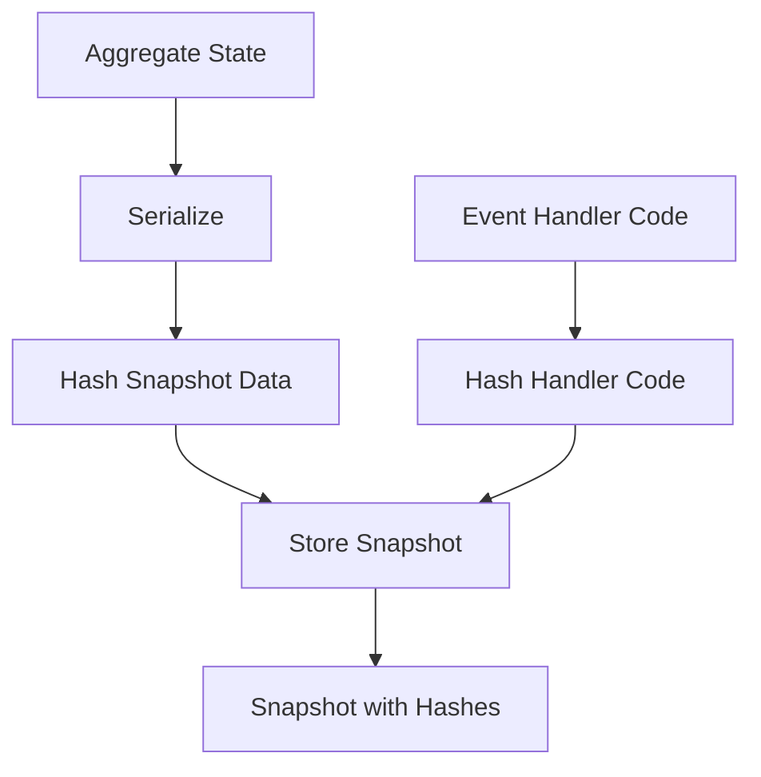
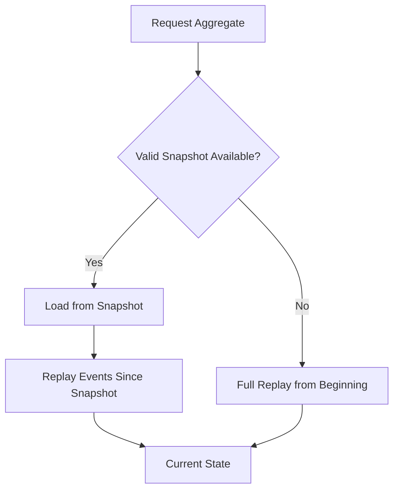

# Snapshots

Snapshots in StreamDingo provide performance optimization by caching aggregate state at specific points, reducing the need to replay all events from the beginning.

## What are Snapshots?

Snapshots are serialized representations of aggregate state at a particular point in time, along with integrity verification hashes.

```csharp
public record SnapshotMetadata(
    string StreamId,
    long EventVersion,
    DateTime CreatedAt,
    string AggregateHash,
    string SnapshotHash
);

public record Snapshot<TAggregate>(
    TAggregate State,
    SnapshotMetadata Metadata
);
```

## Snapshot Creation

### Automatic Snapshots
Configure automatic snapshot creation:

```csharp
services.Configure<SnapshotOptions>(options =>
{
    options.SnapshotEveryNEvents = 100;    // Create snapshot every 100 events
    options.MaxSnapshotsPerStream = 10;    // Keep last 10 snapshots
    options.EnableAutomaticSnapshots = true;
});
```

### Manual Snapshots
Create snapshots manually at strategic points:

```csharp
var currentState = await streamManager.ReplayEventsAsync<UserAggregate>(userId);
await snapshotStore.SaveSnapshotAsync(userId, currentState);
```

## Hash-Based Integrity

### Snapshot Hashing
Each snapshot includes multiple hashes for integrity verification:



### Verification Process
When loading snapshots, hashes are verified:

```csharp
public async Task<Snapshot<TAggregate>?> LoadVerifiedSnapshotAsync<TAggregate>(string streamId)
{
    var snapshot = await snapshotStore.GetSnapshotAsync<TAggregate>(streamId);
    if (snapshot == null) return null;
    
    // Verify snapshot data integrity
    var currentSnapshotHash = hashProvider.HashObject(snapshot.State);
    if (currentSnapshotHash != snapshot.Metadata.SnapshotHash)
    {
        logger.LogWarning("Snapshot data corruption detected for {StreamId}", streamId);
        return null; // Force full replay
    }
    
    // Verify handler code hasn't changed
    var currentHandlerHash = hashProvider.HashEventHandlers<TAggregate>();
    if (currentHandlerHash != snapshot.Metadata.AggregateHash)
    {
        logger.LogInformation("Event handler code changed for {StreamId}, replay required", streamId);
        return null; // Force replay due to handler changes
    }
    
    return snapshot;
}
```

## Snapshot Strategies

### Frequency-Based
Create snapshots based on event count:

```csharp
public class FrequencySnapshotStrategy : ISnapshotStrategy
{
    private readonly int _eventFrequency;
    
    public FrequencySnapshotStrategy(int eventFrequency = 100)
    {
        _eventFrequency = eventFrequency;
    }
    
    public bool ShouldCreateSnapshot(long currentVersion, DateTime lastSnapshotTime)
    {
        return currentVersion % _eventFrequency == 0;
    }
}
```

### Time-Based
Create snapshots based on time intervals:

```csharp
public class TimeBasedSnapshotStrategy : ISnapshotStrategy
{
    private readonly TimeSpan _interval;
    
    public TimeBasedSnapshotStrategy(TimeSpan interval)
    {
        _interval = interval;
    }
    
    public bool ShouldCreateSnapshot(long currentVersion, DateTime lastSnapshotTime)
    {
        return DateTime.UtcNow - lastSnapshotTime > _interval;
    }
}
```

### Hybrid Strategy
Combine multiple strategies:

```csharp
public class HybridSnapshotStrategy : ISnapshotStrategy
{
    public bool ShouldCreateSnapshot(long currentVersion, DateTime lastSnapshotTime)
    {
        // Create snapshot if either condition is met
        return currentVersion % 100 == 0 || // Every 100 events
               DateTime.UtcNow - lastSnapshotTime > TimeSpan.FromHours(1); // Every hour
    }
}
```

## Snapshot Storage

### In-Memory Storage
For development and testing:

```csharp
public class InMemorySnapshotStore : ISnapshotStore
{
    private readonly ConcurrentDictionary<string, object> _snapshots = new();
    
    public Task SaveSnapshotAsync<TAggregate>(string streamId, Snapshot<TAggregate> snapshot)
    {
        _snapshots[streamId] = snapshot;
        return Task.CompletedTask;
    }
    
    public Task<Snapshot<TAggregate>?> GetSnapshotAsync<TAggregate>(string streamId)
    {
        return Task.FromResult(_snapshots.TryGetValue(streamId, out var snapshot) 
            ? (Snapshot<TAggregate>?)snapshot 
            : null);
    }
}
```

### Database Storage
For production scenarios:

```csharp
public class SqlSnapshotStore : ISnapshotStore
{
    public async Task SaveSnapshotAsync<TAggregate>(string streamId, Snapshot<TAggregate> snapshot)
    {
        var json = JsonSerializer.Serialize(snapshot.State);
        
        await connection.ExecuteAsync(@"
            INSERT INTO Snapshots (StreamId, AggregateType, Version, Data, CreatedAt, SnapshotHash, AggregateHash)
            VALUES (@StreamId, @AggregateType, @Version, @Data, @CreatedAt, @SnapshotHash, @AggregateHash)",
            new
            {
                StreamId = streamId,
                AggregateType = typeof(TAggregate).FullName,
                Version = snapshot.Metadata.EventVersion,
                Data = json,
                CreatedAt = snapshot.Metadata.CreatedAt,
                SnapshotHash = snapshot.Metadata.SnapshotHash,
                AggregateHash = snapshot.Metadata.AggregateHash
            });
    }
}
```

## Replay from Snapshots

### Optimal Replay Strategy
StreamDingo automatically chooses the best replay strategy:



### Implementation
```csharp
public async Task<TAggregate?> ReplayEventsAsync<TAggregate>(string streamId)
{
    // Try to load verified snapshot
    var snapshot = await LoadVerifiedSnapshotAsync<TAggregate>(streamId);
    
    TAggregate? currentState;
    long fromVersion;
    
    if (snapshot != null)
    {
        currentState = snapshot.State;
        fromVersion = snapshot.Metadata.EventVersion + 1;
        logger.LogDebug("Loaded snapshot for {StreamId} at version {Version}", 
            streamId, snapshot.Metadata.EventVersion);
    }
    else
    {
        currentState = default;
        fromVersion = 0;
        logger.LogDebug("No valid snapshot found for {StreamId}, replaying from beginning", streamId);
    }
    
    // Replay events from snapshot point or beginning
    var events = await eventStore.GetEventsAsync(streamId, fromVersion);
    return await ApplyEventsAsync(currentState, events);
}
```

## Snapshot Cleanup

### Automatic Cleanup
Remove old snapshots to save storage:

```csharp
public class SnapshotCleanupService : IHostedService
{
    private readonly Timer _timer;
    private readonly ISnapshotStore _snapshotStore;
    
    public async Task ExecuteAsync()
    {
        var cutoffDate = DateTime.UtcNow.AddDays(-30); // Keep 30 days
        await _snapshotStore.DeleteSnapshotsOlderThanAsync(cutoffDate);
    }
}
```

### Retention Policies
Configure different retention policies:

```csharp
services.Configure<SnapshotRetentionOptions>(options =>
{
    options.RetentionPolicies.Add(new SnapshotRetentionPolicy
    {
        AggregateType = typeof(UserAggregate),
        MaxSnapshots = 5,
        MaxAge = TimeSpan.FromDays(90)
    });
    
    options.RetentionPolicies.Add(new SnapshotRetentionPolicy
    {
        AggregateType = typeof(OrderAggregate),
        MaxSnapshots = 10,
        MaxAge = TimeSpan.FromDays(365) // Orders kept longer
    });
});
```

## Performance Optimization

### Snapshot Size Optimization
Keep snapshots small for better performance:

```csharp
// ✅ Good: Minimal snapshot
public record UserAggregateSnapshot(
    string Id,
    string Email,
    UserStatus Status,
    int Version
);

// ❌ Avoid: Including derived/computable data
public record UserAggregateSnapshotBad(
    string Id,
    string Email,
    UserStatus Status,
    int Version,
    string DisplayName,        // Can be computed
    List<string> EventHistory, // Stored separately
    Dictionary<string, object> Cache // Runtime data
);
```

### Compression
Compress large snapshots:

```csharp
public async Task SaveSnapshotAsync<TAggregate>(string streamId, Snapshot<TAggregate> snapshot)
{
    var json = JsonSerializer.Serialize(snapshot.State);
    var compressed = await CompressionHelper.CompressAsync(json);
    
    // Store compressed data
    await StoreCompressedSnapshotAsync(streamId, compressed, snapshot.Metadata);
}
```

## Testing Snapshots

### Snapshot Creation Tests
```csharp
[Test]
public async Task Should_Create_Snapshot_After_Threshold()
{
    // Arrange
    var options = Options.Create(new SnapshotOptions { SnapshotEveryNEvents = 5 });
    var streamManager = new EventStreamManager(eventStore, snapshotStore, options);
    
    // Act: Add events up to threshold
    var events = Enumerable.Range(1, 5)
        .Select(i => new UserEmailChanged($"user-1", $"email{i}@example.com"))
        .Cast<object>();
        
    await streamManager.AppendEventsAsync("user-1", events);
    
    // Assert
    var snapshot = await snapshotStore.GetSnapshotAsync<UserAggregate>("user-1");
    Assert.That(snapshot, Is.Not.Null);
    Assert.That(snapshot.Metadata.EventVersion, Is.EqualTo(5));
}
```

### Hash Verification Tests
```csharp
[Test]
public async Task Should_Reject_Corrupted_Snapshot()
{
    // Arrange
    var validSnapshot = new Snapshot<UserAggregate>(
        new UserAggregate("user-1", "test@example.com", "Test User", UserStatus.Active, 5),
        new SnapshotMetadata("user-1", 5, DateTime.UtcNow, "valid-hash", "valid-snapshot-hash")
    );
    
    await snapshotStore.SaveSnapshotAsync("user-1", validSnapshot);
    
    // Act: Corrupt the snapshot hash
    await CorruptSnapshotHashAsync("user-1");
    
    // Assert
    var loadedSnapshot = await LoadVerifiedSnapshotAsync<UserAggregate>("user-1");
    Assert.That(loadedSnapshot, Is.Null); // Should be rejected
}
```

## Common Issues and Solutions

### Snapshot Version Mismatch
```csharp
// Problem: Aggregate schema changed but snapshot is old version
public record UserAggregateV1(string Id, string Email);
public record UserAggregateV2(string Id, string Email, string PhoneNumber);

// Solution: Version-aware snapshot loading
public async Task<Snapshot<TAggregate>?> GetSnapshotAsync<TAggregate>(string streamId)
{
    var snapshotData = await LoadSnapshotDataAsync(streamId);
    if (snapshotData == null) return null;
    
    return snapshotData.AggregateVersion switch
    {
        1 => MigrateFromV1<TAggregate>(snapshotData),
        2 => DeserializeV2<TAggregate>(snapshotData),
        _ => throw new NotSupportedException($"Unsupported snapshot version: {snapshotData.AggregateVersion}")
    };
}
```

### Performance Issues
Monitor snapshot performance:

```csharp
public async Task<TAggregate?> ReplayEventsAsync<TAggregate>(string streamId)
{
    using var activity = _activitySource.StartActivity("ReplayEvents");
    activity?.SetTag("StreamId", streamId);
    activity?.SetTag("AggregateType", typeof(TAggregate).Name);
    
    var stopwatch = Stopwatch.StartNew();
    var snapshot = await LoadVerifiedSnapshotAsync<TAggregate>(streamId);
    
    if (snapshot != null)
    {
        activity?.SetTag("SnapshotUsed", true);
        activity?.SetTag("SnapshotVersion", snapshot.Metadata.EventVersion);
    }
    
    var result = await ReplayFromSnapshot(snapshot, streamId);
    
    activity?.SetTag("ReplayDurationMs", stopwatch.ElapsedMilliseconds);
    return result;
}
```

## Next Steps

- Learn about [Hash Integrity](hash-integrity.html) verification in detail
- Understand [Event Replay](event-replay.html) strategies  
- Explore [Storage Providers](storage-providers.html) for different backends
- See [Performance](../advanced/performance.html) optimization techniques
