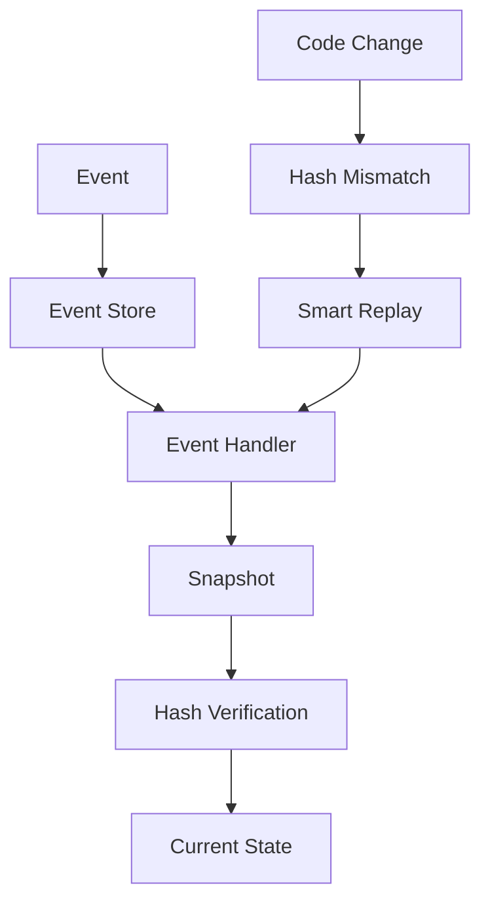

# StreamDingo Documentation

Welcome to the official documentation for StreamDingo, a high-performance .NET library for event sourcing with hash-based integrity verification and snapshot-based replay.

## Overview

StreamDingo makes event sourcing simple and reliable by providing:

- **Clean API**: Intuitive event sourcing patterns
- **Hash Integrity**: Built-in verification using cryptographic hashes
- **Smart Replay**: Efficient snapshot-based event replay
- **High Performance**: Optimized for throughput with minimal allocations
- **Type Safety**: Strongly typed event handlers and snapshots

## Quick Example

```csharp
using StreamDingo;

// Define events
public record UserCreated(string Name, string Email);
public record UserEmailUpdated(string NewEmail);

// Define state
public record UserState(string Name, string Email, bool IsActive = true);

// Create event handlers
public class UserEventHandlers
{
    public static UserState Apply(UserState? state, UserCreated @event)
        => new UserState(@event.Name, @event.Email);

    public static UserState Apply(UserState state, UserEmailUpdated @event)
        => state with { Email = @event.NewEmail };
}

// Use the event store
var eventStore = new StreamDingoEventStore();
var streamId = Guid.NewGuid();

await eventStore.AppendAsync(streamId, new UserCreated("John Doe", "john@example.com"));
await eventStore.AppendAsync(streamId, new UserEmailUpdated("john.doe@example.com"));

var currentState = await eventStore.ReplayAsync<UserState>(streamId);
```

## Key Features

### Event Sourcing Made Simple
Stream events as the single source of truth, with automatic state reconstruction from event history.

### Hash-Based Integrity
Every event handler and snapshot is cryptographically hashed to detect changes and ensure data integrity.

### Intelligent Replay
When event order changes or handler code changes, StreamDingo automatically replays from optimal snapshots.

### High Performance
Designed for high-throughput scenarios with minimal memory allocations and optimized data structures.

## Getting Started

1. **[Installation](getting-started/installation.html)** - Add StreamDingo to your project
2. **[Quick Start](getting-started/quickstart.html)** - Build your first event-sourced application
3. **[Basic Concepts](getting-started/concepts.html)** - Understand the core principles

## Architecture Overview



## Status

!!! warning "Development Status"
    StreamDingo is currently in active development. The API may change before the first stable release.

## Community

- **GitHub Repository**: [alexwiese/StreamDingo](https://github.com/alexwiese/StreamDingo)
- **Issues & Questions**: [GitHub Issues](https://github.com/alexwiese/StreamDingo/issues)
- **Discussions**: [GitHub Discussions](https://github.com/alexwiese/StreamDingo/discussions)

## License

StreamDingo is licensed under the [MIT License](https://github.com/alexwiese/StreamDingo/blob/main/LICENSE).