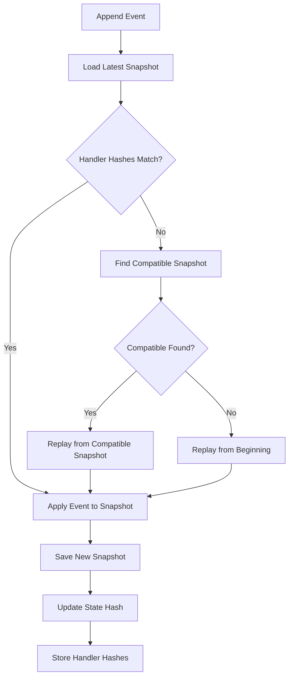

---
---
# StreamDingo - Technical Specification

> **Event Sourcing .NET Library with Hash-Based Integrity Verification**

## 🎯 Overview

StreamDingo is a high-performance .NET library for event sourcing that provides:
- **Hash-based integrity verification** using alexwiese/hashstamp
- **Snapshot-based event replay** for efficient state reconstruction
- **Intelligent replay optimization** when event handlers change
- **Production-ready performance** with minimal allocations

## 🏗️ Architecture

### Core Components

#### 1. Event Handler System
```csharp
public interface IEventHandler<TState, TEvent>
    where TState : class
    where TEvent : IEvent
{
    TState Handle(TState? previousSnapshot, TEvent @event);
}
```

**Key Features:**
- Pure functions: `(previousSnapshot, event) → newSnapshot`
- Stateless and deterministic
- Hash-verified using hashstamp source generator
- Support for both mutable and immutable state objects

#### 2. Event Store Abstraction
```csharp
public interface IEventStore
{
    ValueTask AppendEventAsync<T>(string streamId, T @event, CancellationToken cancellationToken = default)
        where T : IEvent;
    
    IAsyncEnumerable<IEvent> ReadEventsAsync(string streamId, long fromVersion = 0, 
        CancellationToken cancellationToken = default);
    
    ValueTask<Snapshot<T>?> GetLatestSnapshotAsync<T>(string streamId, 
        CancellationToken cancellationToken = default) where T : class;
    
    ValueTask SaveSnapshotAsync<T>(string streamId, Snapshot<T> snapshot, 
        CancellationToken cancellationToken = default) where T : class;
}
```

#### 3. Snapshot Management
```csharp
public class Snapshot<T> where T : class
{
    public string StreamId { get; init; }
    public long Version { get; init; }
    public T State { get; init; }
    public string Hash { get; init; }
    public DateTime CreatedAt { get; init; }
    public Dictionary<string, string> HandlerHashes { get; init; }
}
```

**Hash Integrity Features:**
- **State Hash**: SHA-256 of serialized state data
- **Handler Hashes**: Hash of each event handler's source code
- **Snapshot Verification**: Detect tampering or corruption
- **Handler Change Detection**: Trigger replay when code changes

#### 4. Event Replay Engine
```csharp
public interface IEventReplayEngine
{
    ValueTask<T> ReplayEventsAsync<T>(string streamId, 
        CancellationToken cancellationToken = default) where T : class;
    
    ValueTask<T> ReplayFromSnapshotAsync<T>(string streamId, Snapshot<T> snapshot,
        CancellationToken cancellationToken = default) where T : class;
}
```

**Intelligent Replay Logic:**
1. Load latest snapshot
2. Compare handler hashes with current code
3. If hashes match: replay from latest snapshot
4. If hashes differ: find last compatible snapshot or replay from beginning
5. Apply events sequentially using current handlers
6. Create new snapshot when complete

### Event Sourcing Flow



## 🚀 Performance Targets

### Throughput Targets
- **Event Append**: >100,000 events/second
- **Event Replay**: >500,000 events/second  
- **Snapshot Creation**: >10,000 snapshots/second
- **Hash Verification**: >1,000,000 hashes/second

### Memory Targets
- **1M Events + Snapshots**: <1GB memory usage
- **Event Processing**: <1KB allocations per event
- **Snapshot Storage**: <500MB for 10,000 snapshots
- **Hash Cache**: <50MB for 100,000 handler hashes

### Latency Targets
- **Single Event Append**: <1ms P99
- **Snapshot Lookup**: <0.5ms P99
- **Hash Verification**: <0.1ms P99
- **Event Replay**: <10ms P99 for 1,000 events

## 🔧 API Design Principles

### 1. Simplicity First
- Minimal configuration required
- Fluent builder patterns for setup
- Convention over configuration
- Clear error messages and exceptions

### 2. Performance Optimized
- `ValueTask<T>` for potentially synchronous operations
- Object pooling for frequent allocations
- Span<T> and Memory<T> for buffer management
- Zero-allocation paths where possible

### 3. Extensibility
- Pluggable event store implementations
- Custom serialization support
- Configurable snapshot policies
- Event transformation and middleware

### 4. Production Ready
- Comprehensive logging and telemetry
- Circuit breaker patterns for reliability
- Retry policies with exponential backoff
- Health checks and monitoring integration

## 📦 Package Structure

### Core Package: StreamDingo
```
StreamDingo/
├── EventSourcing/
│   ├── IEvent.cs
│   ├── IEventHandler.cs
│   ├── IEventStore.cs
│   └── EventReplayEngine.cs
├── Snapshots/
│   ├── Snapshot.cs
│   ├── ISnapshotStore.cs
│   └── SnapshotManager.cs
├── Integrity/
│   ├── IHashProvider.cs
│   ├── HashStampIntegration.cs
│   └── IntegrityVerifier.cs
└── Configuration/
    ├── StreamDingoOptions.cs
    └── EventSourcingBuilder.cs
```

### Storage Providers (Separate Packages)
- **StreamDingo.SqlServer**: SQL Server provider
- **StreamDingo.PostgreSQL**: PostgreSQL provider  
- **StreamDingo.InMemory**: In-memory provider for testing
- **StreamDingo.FileSystem**: File-based provider for simple scenarios

## 🔄 Integration with HashStamp

### Setup Integration
```csharp
// In StreamDingo.csproj
<PackageReference Include="HashStamp" Version="1.0.0" PrivateAssets="analyzers" />
```

### Usage Pattern
```csharp
// Event handlers automatically get hashes generated
public class OrderEventHandler : IEventHandler<OrderState, OrderCreated>
{
    public OrderState Handle(OrderState? previous, OrderCreated @event)
    {
        // Method body hash: HashStamps.OrderEventHandler.Handle
        return new OrderState 
        { 
            Id = @event.OrderId, 
            Status = "Created" 
        };
    }
}

// Integrity verification
var currentHash = HashStamps.OrderEventHandler.Handle;
var snapshotHash = snapshot.HandlerHashes["OrderEventHandler.Handle"];
var needsReplay = currentHash != snapshotHash;
```

## 📊 Use Cases and User Personas

### Primary Use Cases

1. **Financial Transaction Systems**
   - Audit trails for regulatory compliance
   - Event replay for transaction verification
   - State reconstruction for balance calculations

2. **E-commerce Order Management**
   - Order lifecycle tracking
   - Inventory state management
   - Customer interaction history

3. **IoT Data Processing**
   - Sensor data aggregation
   - Device state tracking
   - Historical data analysis

4. **Domain Event Systems**
   - Microservice communication
   - CQRS implementation
   - Distributed system coordination

### User Personas

#### 1. Enterprise Developer
- **Needs**: Reliable, well-documented, production-ready
- **Priorities**: Performance, security, compliance
- **Pain Points**: Complex setup, poor documentation

#### 2. Startup Developer  
- **Needs**: Quick setup, flexible, cost-effective
- **Priorities**: Rapid development, scalability
- **Pain Points**: Over-engineering, expensive licenses

#### 3. Open Source Contributor
- **Needs**: Clean code, good test coverage, clear contribution guidelines
- **Priorities**: Code quality, learning opportunities
- **Pain Points**: Poor project structure, lack of tests

## 🎯 Success Metrics

### Technical Metrics
- **Test Coverage**: >90% line coverage
- **Performance**: Meet all latency and throughput targets
- **Memory**: Zero detectable memory leaks
- **Security**: Zero high-severity vulnerabilities

### Community Metrics  
- **GitHub Stars**: >100 within 3 months
- **NuGet Downloads**: >1,000 within 6 months
- **Community PRs**: >5 external contributions
- **Issue Response**: <48 hours average response time

### Quality Metrics
- **Documentation**: 100% public API documented
- **Examples**: >5 comprehensive usage examples
- **Breaking Changes**: <1 per major version
- **Bug Reports**: <10 open bugs at any time

## 🔒 Security Considerations

### Hash Integrity
- SHA-256 for all hash calculations
- Collision detection and handling
- Secure hash storage and transmission
- Protection against hash manipulation

### Data Protection
- Optional encryption for sensitive events
- Secure snapshot storage
- Audit trail protection
- GDPR compliance considerations

### Access Control
- Event store access controls
- Snapshot access permissions
- Administrative operation restrictions
- API rate limiting capabilities

## 🧪 Testing Strategy

### Unit Testing (>90% Coverage)
- Event handler registration and execution
- Snapshot creation and validation
- Hash calculation and verification
- Error handling and edge cases
- Serialization and deserialization

### Integration Testing
- End-to-end event sourcing scenarios
- Storage provider integration
- Concurrency and thread safety
- Performance under load
- Data corruption recovery

### Performance Testing
- Throughput benchmarks
- Memory allocation profiling
- Latency measurements
- Stress testing scenarios
- Scalability validation

## 📈 Monitoring and Observability

### Metrics
- Event processing rates
- Snapshot creation frequency
- Hash verification timing
- Memory usage patterns
- Error rates and types

### Logging
- Structured logging with Serilog
- Correlation IDs for request tracking
- Performance counters
- Error details and stack traces
- Debug information for development

### Health Checks
- Event store connectivity
- Snapshot store accessibility
- Hash verification integrity
- Memory usage thresholds
- Performance degradation detection

---

**Last Updated**: $(date)  
**Version**: 1.0  
**Status**: Draft