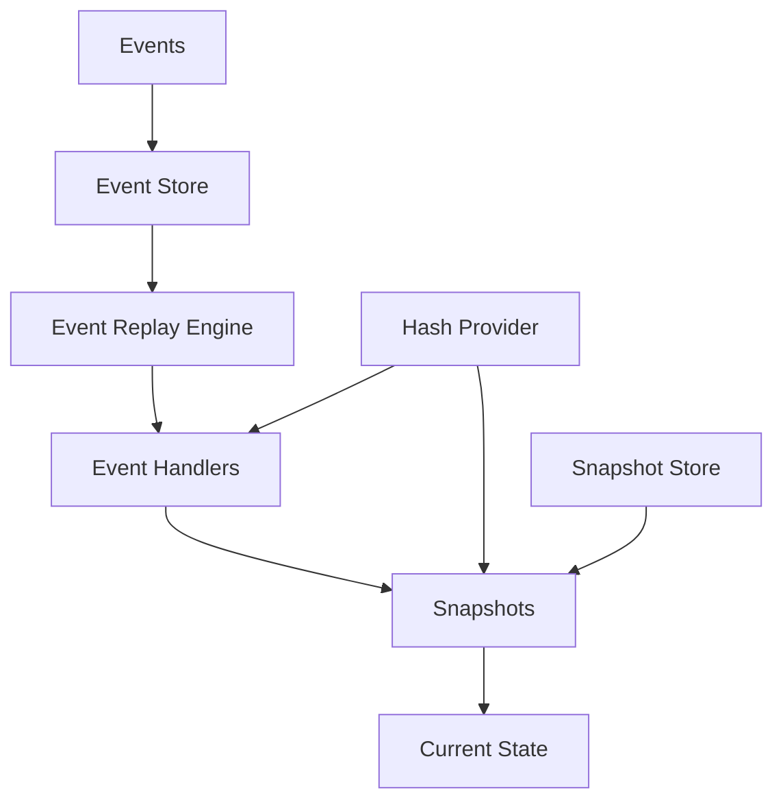

# Basic Concepts

Understanding the core concepts of StreamDingo will help you build robust event-sourced applications.

## Event Sourcing Fundamentals

### Events
Events are immutable records of things that have happened in your system. In StreamDingo, events should be:

- **Immutable**: Once created, events never change
- **Descriptive**: Event names should describe what happened in past tense
- **Minimal**: Include only the data necessary to represent the change

```csharp
// Good: Descriptive and minimal
public record OrderPlaced(string OrderId, string CustomerId, decimal Amount, DateTime PlacedAt);

// Avoid: Present tense or overly generic
public record PlaceOrder(string OrderId, string CustomerId, decimal Amount);
```

### Aggregates
Aggregates represent the current state of your domain entities, built by applying a sequence of events:

```csharp
public record OrderAggregate(
    string Id,
    string CustomerId, 
    decimal Amount,
    OrderStatus Status,
    int Version
);
```

### Event Handlers
Event handlers are pure functions that take the current aggregate state and an event, returning the new state:

```csharp
public static OrderAggregate Handle(OrderAggregate? state, OrderPlaced @event)
    => new(@event.OrderId, @event.CustomerId, @event.Amount, OrderStatus.Placed, (state?.Version ?? 0) + 1);
```

## StreamDingo Specific Concepts

### Hash-Based Integrity
StreamDingo uses the [alexwiese/hashstamp](https://github.com/alexwiese/hashstamp) library to ensure integrity:

- **Event Handler Hashing**: Detects when handler logic changes
- **Snapshot Hashing**: Verifies snapshot data hasn't been tampered with
- **Event Hashing**: Ensures events haven't been modified

### Snapshots
Snapshots are cached aggregate states that improve replay performance:

- Created automatically at configurable intervals
- Include hash verification for data integrity
- Enable efficient replay from intermediate points
- Reduce the need to replay all events from the beginning

### Event Replay
When changes are detected, StreamDingo intelligently replays events:

- **Handler Changes**: Replay events affected by handler logic changes
- **Snapshot Corruption**: Replay from the last valid snapshot
- **Order Changes**: Replay when event ordering is modified

## Event Stream Architecture



### Event Store
- Persists events in ordered streams
- Supports multiple storage providers (In-Memory, SQL Server, PostgreSQL)
- Ensures event ordering and consistency

### Snapshot Store
- Stores aggregate snapshots with hash verification
- Enables fast state reconstruction
- Automatic cleanup of old snapshots

### Hash Provider
- Generates and verifies hashes for integrity checking
- Integrates with alexwiese/hashstamp library
- Detects code changes and data corruption

## Best Practices

### Event Design
1. **Use past tense**: `OrderPlaced` not `PlaceOrder`
2. **Be specific**: `PaymentProcessed` not `OrderUpdated`
3. **Include context**: Add relevant timestamps and user information

### Handler Design
1. **Keep handlers pure**: No side effects or external dependencies
2. **Handle nulls**: First event should handle null previous state
3. **Version tracking**: Always increment version numbers

### Aggregate Design
1. **Include version**: Track aggregate version for optimistic concurrency
2. **Keep focused**: Aggregates should have a single responsibility
3. **Use records**: Immutable records work well for aggregate state

## Common Patterns

### Command-Event Pattern
```csharp
// Command (intent)
public record PlaceOrderCommand(string OrderId, string CustomerId, decimal Amount);

// Event (fact)
public record OrderPlaced(string OrderId, string CustomerId, decimal Amount, DateTime PlacedAt);

// Handler
public class OrderCommandHandler
{
    public async Task<IEnumerable<object>> Handle(PlaceOrderCommand command)
    {
        // Validation logic here
        return new[] { new OrderPlaced(command.OrderId, command.CustomerId, command.Amount, DateTime.UtcNow) };
    }
}
```

### Saga Pattern
For long-running processes that span multiple aggregates:

```csharp
public record OrderSagaState(string OrderId, bool PaymentProcessed, bool InventoryReserved, bool EmailSent);

public static OrderSagaState Handle(OrderSagaState? state, OrderPlaced @event)
    => new(@event.OrderId, false, false, false);
```

## Next Steps

- Learn about [Event Handlers](../guide/event-handlers.md) in detail
- Understand [Snapshot Management](../guide/snapshots.md)
- Explore [Hash Integrity Verification](../guide/hash-integrity.md)