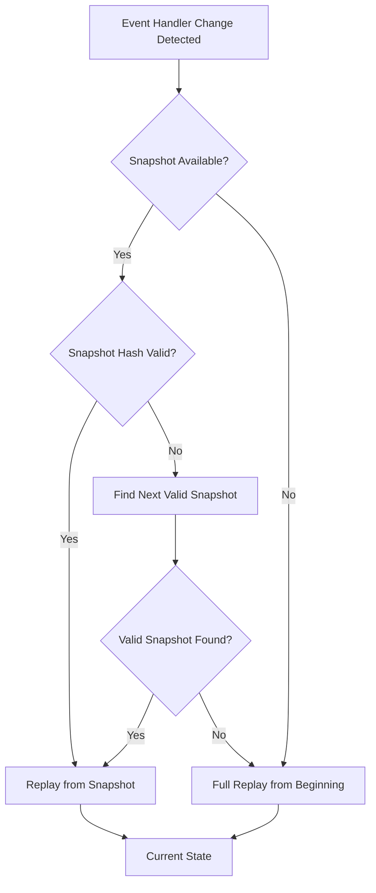

# Hash Integrity

StreamDingo uses hash-based integrity verification to ensure the reliability of your event-sourced system by detecting changes in event handler code and verifying data integrity.

## Overview

Hash integrity verification serves two main purposes:
1. **Code Change Detection**: Detects when event handler code changes, triggering necessary replays
2. **Data Integrity**: Verifies that stored snapshots and events haven't been corrupted or tampered with

## Hash Provider Integration

StreamDingo integrates with the `alexwiese/hashstamp` library for robust hash generation:

```csharp
services.AddSingleton<IHashProvider, HashStampProvider>();
```

### Hash Types

#### Handler Code Hashes
Generated from event handler method bodies and their dependencies:

```csharp
public class HashStampProvider : IHashProvider
{
    public string HashEventHandlers<TAggregate>()
    {
        var handlerMethods = GetEventHandlerMethods<TAggregate>();
        var combinedHash = new StringBuilder();
        
        foreach (var method in handlerMethods)
        {
            var methodHash = HashStamp.GenerateHash(method);
            combinedHash.Append(methodHash);
        }
        
        return HashStamp.GenerateHash(combinedHash.ToString());
    }
}
```

#### Data Hashes
Generated from serialized object data:

```csharp
public string HashObject<T>(T obj)
{
    var json = JsonSerializer.Serialize(obj, _jsonOptions);
    return HashStamp.GenerateHash(json);
}
```

## Change Detection Scenarios

### Handler Code Changes
When event handler code changes, affected events must be replayed:

```csharp
// Original handler
public static UserAggregate Handle(UserAggregate? state, UserCreated @event)
    => new UserAggregate(@event.UserId, @event.Name, @event.Email, 1);

// Modified handler (business logic change)
public static UserAggregate Handle(UserAggregate? state, UserCreated @event)
    => new UserAggregate(@event.UserId, @event.Name?.ToUpper(), @event.Email, 1); // Name now uppercase
```

### What Triggers Hash Changes

#### Code Changes That Matter
```csharp
// ✅ These changes trigger replay (as they should)
public static UserAggregate Handle(UserAggregate? state, UserCreated @event)
{
    // Business logic change
    var normalizedEmail = @event.Email.ToLowerInvariant(); // NEW
    
    // Validation change
    if (string.IsNullOrEmpty(@event.Name)) // NEW
        throw new ArgumentException("Name cannot be empty");
    
    return new UserAggregate(@event.UserId, @event.Name, normalizedEmail, 1);
}
```

#### Code Changes That Don't Matter
```csharp
// ❌ These changes also trigger replay (but shouldn't affect behavior)
public static UserAggregate Handle(UserAggregate? state, UserCreated @event)
{
    // Comment changes trigger hash changes
    // This is a new comment that changes the hash
    
    // Variable name changes trigger hash changes  
    var userId = @event.UserId; // was: var id = @event.UserId;
    
    // Whitespace changes trigger hash changes
    return new UserAggregate(userId, @event.Name, 
                           @event.Email, 1); // Different formatting
}
```

## Replay Strategies

### Intelligent Replay
StreamDingo determines optimal replay strategies based on hash changes:



### Implementation
```csharp
public async Task<TAggregate?> ReplayWithHashVerificationAsync<TAggregate>(string streamId)
{
    var currentHandlerHash = _hashProvider.HashEventHandlers<TAggregate>();
    
    // Check if we have a valid snapshot
    var snapshots = await _snapshotStore.GetSnapshotsAsync<TAggregate>(streamId);
    
    foreach (var snapshot in snapshots.OrderByDescending(s => s.Metadata.EventVersion))
    {
        // Verify snapshot data integrity
        var snapshotDataHash = _hashProvider.HashObject(snapshot.State);
        if (snapshotDataHash != snapshot.Metadata.SnapshotHash)
        {
            _logger.LogWarning("Snapshot data corruption detected at version {Version}", 
                snapshot.Metadata.EventVersion);
            continue; // Try older snapshot
        }
        
        // Check if handler code has changed since snapshot
        if (currentHandlerHash == snapshot.Metadata.AggregateHash)
        {
            // Handler hasn't changed, can use this snapshot
            return await ReplayFromSnapshotAsync(snapshot, streamId);
        }
        
        _logger.LogInformation("Handler code changed since snapshot at version {Version}, continuing search", 
            snapshot.Metadata.EventVersion);
    }
    
    // No valid snapshot found, replay from beginning
    _logger.LogInformation("No valid snapshot found for {StreamId}, replaying from beginning", streamId);
    return await ReplayFromBeginningAsync<TAggregate>(streamId);
}
```

## Data Integrity Verification

### Snapshot Verification
Verify snapshot integrity when loading:

```csharp
public async Task<bool> VerifySnapshotIntegrityAsync<TAggregate>(string streamId)
{
    var snapshot = await _snapshotStore.GetSnapshotAsync<TAggregate>(streamId);
    if (snapshot == null) return true; // No snapshot to verify
    
    var currentHash = _hashProvider.HashObject(snapshot.State);
    var storedHash = snapshot.Metadata.SnapshotHash;
    
    if (currentHash != storedHash)
    {
        _logger.LogError("Snapshot integrity verification failed for {StreamId}. " +
                        "Current hash: {CurrentHash}, Stored hash: {StoredHash}",
                        streamId, currentHash, storedHash);
        return false;
    }
    
    return true;
}
```

### Event Integrity (Future Feature)
Individual event integrity verification:

```csharp
public class EventWithHash
{
    public object Event { get; set; }
    public string EventHash { get; set; }
    public long Version { get; set; }
    public DateTime Timestamp { get; set; }
}

public async Task<bool> VerifyEventIntegrityAsync(string streamId, long version)
{
    var eventData = await _eventStore.GetEventAsync(streamId, version);
    if (eventData == null) return false;
    
    var currentHash = _hashProvider.HashObject(eventData.Event);
    return currentHash == eventData.EventHash;
}
```

## Performance Considerations

### Hash Caching
Cache handler hashes to avoid repeated computation:

```csharp
public class CachedHashProvider : IHashProvider
{
    private readonly ConcurrentDictionary<Type, string> _handlerHashCache = new();
    private readonly IHashProvider _innerProvider;
    
    public string HashEventHandlers<TAggregate>()
    {
        return _handlerHashCache.GetOrAdd(typeof(TAggregate), 
            _ => _innerProvider.HashEventHandlers<TAggregate>());
    }
    
    public void InvalidateCache<TAggregate>()
    {
        _handlerHashCache.TryRemove(typeof(TAggregate), out _);
    }
}
```

### Selective Hashing
Only hash relevant parts of handlers:

```csharp
public string HashEventHandlers<TAggregate>()
{
    var relevantMethods = typeof(TAggregate).Assembly
        .GetTypes()
        .SelectMany(t => t.GetMethods())
        .Where(m => IsEventHandlerMethod<TAggregate>(m))
        .Where(m => !HasIgnoreHashAttribute(m)); // Allow excluding certain methods
    
    return HashMethods(relevantMethods);
}
```

## Configuration Options

### Hash Provider Options
```csharp
services.Configure<HashProviderOptions>(options =>
{
    options.IncludeMethodComments = false;    // Ignore comment changes
    options.IgnoreWhitespaceChanges = true;   // Ignore formatting changes
    options.HashPrivateMethods = false;       // Only hash public handler methods
    options.CacheHashResults = true;          // Enable hash caching
});
```

### Integrity Check Frequency
```csharp
services.Configure<IntegrityCheckOptions>(options =>
{
    options.VerifySnapshotIntegrity = true;           // Always verify snapshots
    options.VerifyEventIntegrity = false;             // Skip individual event verification (expensive)
    options.PeriodicIntegrityCheck = TimeSpan.FromHours(24); // Full integrity check daily
});
```

## Monitoring and Alerting

### Hash Change Monitoring
Track when handler changes trigger replays:

```csharp
public class HashChangeTracker
{
    public async Task OnHandlerHashChanged<TAggregate>(string oldHash, string newHash)
    {
        var changeInfo = new HandlerHashChangeEvent
        {
            AggregateType = typeof(TAggregate).Name,
            OldHash = oldHash,
            NewHash = newHash,
            Timestamp = DateTime.UtcNow,
            RequiredReplays = await GetAffectedStreamsAsync<TAggregate>()
        };
        
        await _eventBus.PublishAsync(changeInfo);
        
        // Alert if many streams need replay
        if (changeInfo.RequiredReplays.Count > 100)
        {
            await _alertingService.SendAlertAsync(
                "High impact handler change detected", 
                $"{changeInfo.RequiredReplays.Count} streams require replay");
        }
    }
}
```

### Integrity Violation Alerts
```csharp
public class IntegrityViolationHandler
{
    public async Task OnSnapshotCorruptionDetected(string streamId, string snapshotHash)
    {
        await _alertingService.SendCriticalAlertAsync(
            "Snapshot corruption detected",
            $"Stream {streamId} has corrupted snapshot with hash {snapshotHash}");
        
        // Automatically attempt recovery
        await _recoveryService.RecoverFromCorruption(streamId);
    }
}
```

## Testing Hash Integrity

### Unit Tests
```csharp
[Test]
public void Should_Generate_Same_Hash_For_Identical_Handlers()
{
    var hash1 = hashProvider.HashEventHandlers<UserAggregate>();
    var hash2 = hashProvider.HashEventHandlers<UserAggregate>();
    
    Assert.That(hash1, Is.EqualTo(hash2));
}

[Test]
public void Should_Generate_Different_Hash_When_Handler_Changes()
{
    var originalHash = hashProvider.HashEventHandlers<UserAggregate>();
    
    // Simulate handler change by modifying the type
    ModifyHandlerCode<UserAggregate>();
    
    var newHash = hashProvider.HashEventHandlers<UserAggregate>();
    
    Assert.That(newHash, Is.Not.EqualTo(originalHash));
}
```

### Integration Tests
```csharp
[Test]
public async Task Should_Replay_From_Valid_Snapshot_When_Data_Intact()
{
    // Create snapshot with valid hash
    var state = new UserAggregate("user-1", "test@example.com", "Test User", UserStatus.Active, 5);
    var snapshot = await CreateValidSnapshotAsync("user-1", state);
    
    // Replay should use snapshot
    var replayedState = await streamManager.ReplayEventsAsync<UserAggregate>("user-1");
    
    Assert.That(replayedState.Version, Is.EqualTo(5)); // Used snapshot, not full replay
}

[Test] 
public async Task Should_Skip_Corrupted_Snapshot_And_Replay_From_Beginning()
{
    // Create corrupted snapshot
    await CreateCorruptedSnapshotAsync("user-1");
    
    // Should detect corruption and replay from beginning
    var replayedState = await streamManager.ReplayEventsAsync<UserAggregate>("user-1");
    
    // Verify full replay occurred (check logs or metrics)
    Assert.That(GetReplaySource("user-1"), Is.EqualTo(ReplaySource.FullReplay));
}
```

## Best Practices

### Handler Stability
Write stable handlers to minimize unnecessary replays:

```csharp
// ✅ Good: Stable, focused handler
public static UserAggregate Handle(UserAggregate? state, UserCreated @event)
    => new UserAggregate(@event.UserId, @event.Name, @event.Email, (state?.Version ?? 0) + 1);

// ❌ Avoid: Handler with changing implementation details
public static UserAggregate Handle(UserAggregate? state, UserCreated @event)
{
    // Avoid complex logic that might change
    var validationResult = ComplexValidation(@event); // This might change
    var processedName = ApplyBusinessRules(@event.Name); // This might change
    
    return new UserAggregate(@event.UserId, processedName, @event.Email, (state?.Version ?? 0) + 1);
}
```

### Separation of Concerns
Keep event handlers pure and move complex logic elsewhere:

```csharp
// ✅ Good: Pure handler with preprocessed data
public record UserCreated(string UserId, string Name, string Email, bool IsValidated);

public static UserAggregate Handle(UserAggregate? state, UserCreated @event)
    => new UserAggregate(@event.UserId, @event.Name, @event.Email, (state?.Version ?? 0) + 1);

// Complex validation happens before event creation
public async Task<UserCreated> CreateValidatedUserEvent(string name, string email)
{
    var isValid = await _validationService.ValidateAsync(name, email);
    return new UserCreated(Guid.NewGuid().ToString(), name, email, isValid);
}
```

## Next Steps

- Learn about [Event Replay](event-replay.md) strategies
- Understand [Storage Providers](storage-providers.md) and their integrity features
- Explore [Performance](../advanced/performance.md) optimization techniques
- See [Migration Strategies](../advanced/migrations.md) for handling schema changes